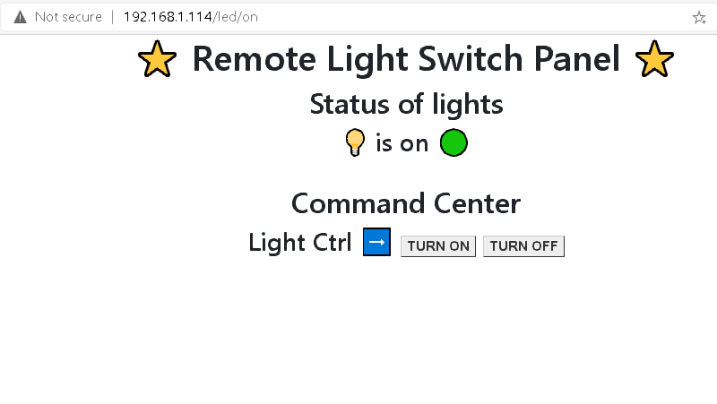

# **raspberrypi server**

used this link 👇

https://towardsdatascience.com/python-webserver-with-flask-and-raspberry-pi-398423cc6f5d

      from flask import Flask
      app = Flask(__name__)
      @app.route('/')
      def index():
         return 'Hello from flask server!!☺️'
      if __name__ == '__main__':
         app.run(debug=True, port=80, host='0.0.0.0')

### **check rpiWebServer.zip in [dowloads](https://github.com/snappercayt/snapp100days/tree/master/rpiWebServer/rpiWebServer)**

1. succesfully installed flask 
2. used flask to host a web page and display server time
3. displayed gpio value on the page
4. next, to take input from page and change board values

### **very important for linux**

      $ cat /etc/os-release

### **sample output 👇👇**

        PRETTY_NAME="Raspbian GNU/Linux 10 (buster)"
        NAME="Raspbian GNU/Linux"
        VERSION_ID="10"
        VERSION="10 (buster)"
        VERSION_CODENAME=buster
        ID=raspbian
        ID_LIKE=debian
        HOME_URL="http://www.raspbian.org/"
        SUPPORT_URL="http://www.raspbian.org/RaspbianForums"
        BUG_REPORT_URL="http://www.raspbian.org/RaspbianBugs"
        

# Jan 13th 2021

1. read about new way to internet : [solid](https://solid.mit.edu/)
2. reading about WSGI started from this [cool thread](https://dev.to/norsemangrey/flask-web-app-on-raspberry-pi-using-docker-24on)

### **So** 

after some tinkering and editing to use the code from [here](https://towardsdatascience.com/python-webserver-with-flask-and-raspberry-pi-398423cc6f5d) it worked!

here is a screenshot 

and here is the [code](https://github.com/snappercayt/snapp100days/tree/master/newapp/newapp)        
